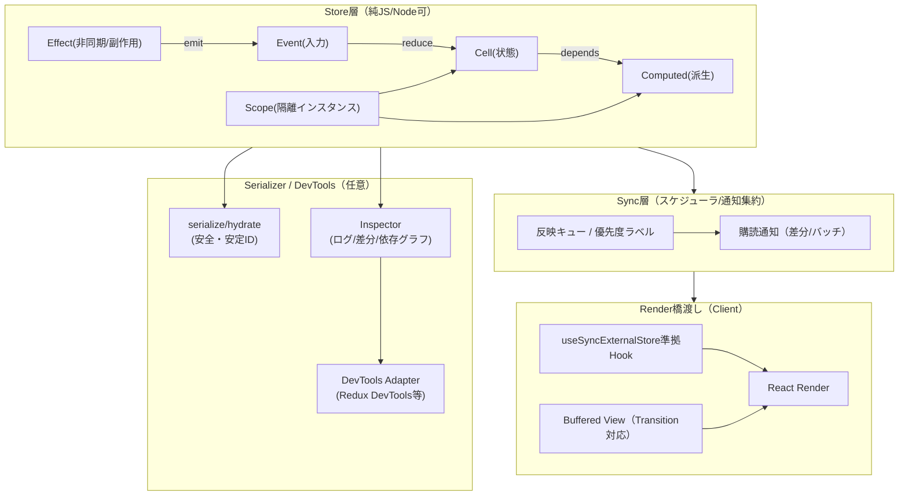

# 次世代React用状態管理ライブラリ構想

## エグゼクティブサマリ

本レポートは、未指定のため「汎用的な中〜大規模SPA/SSR対応アプリ」を想定し、React 19時代（RSC/Server Actions/並列レンダリング）に“実装可能な仕様書レベル”で通用する次世代状態管理ライブラリ（仮称：**NexState**）の構想を提示する。中核課題は、外部ストア購読の標準である `useSyncExternalStore` が **tear-free（描画中に異なる状態版を読む不整合＝tearingを避ける）** のために設計される一方、**Transition（非ブロッキング更新）との両立が難しく、ストア更新がTransition中に起きるとReactが更新をblockingにフォールバックする**点にある。これはReact公式ドキュメントの「Caveats」として明記され、React Labsでも「`useSyncExternalStore` はConcurrent機能（transitions等）からのbail outになりうる」という研究テーマとして再言及されている。citeturn6view1turn4view0

さらに、React Server Components（RSC）は「ビルド/リクエスト時に、クライアントと分離された環境で“バンドル前に”実行される」ため、状態管理は **Client Component境界での状態・副作用・永続化**と、**サーバー⇄クライアント境界での状態輸送（serialize/hydrate）**に再配置される。RSC実装（バンドラ/フレームワーク）向けの内部APIは semver に従わず React 19.x minor でも破壊され得る、とReact公式は明記している。よって次世代ライブラリは、RSCバンドラ内部APIへの依存を避けつつ、`react-server` export condition 等でRSC互換の“エントリポイント分離”を設計に組み込む必要がある。citeturn2view2turn2view3turn16view0

加えて、2025年末〜2026年初にかけて、RSCの通信・シリアライズ（Flightペイロード）周辺で重大な安全性問題（不正デシリアライズに起因するRCE等）が公的機関・セキュリティ企業から警告されている。次世代状態管理の「状態輸送」設計は、**入力を常に不信（untrusted）として扱う**・**安全なシリアライズ形式**・**スコープ分離（リクエスト跨ぎ汚染防止）**を最初から要求仕様に入れるべきである。citeturn15view0turn15view1turn15view2turn2view0

本提案の要点は次の通り。

- **状態は“スコープ明示のCell（atom相当）”として管理**し、派生は“Computed（selector相当）”、更新は“Event/Effect（データフロー相当）”で表す（Jotai/Effector/Reduxの長所統合）。citeturn19view0turn18view2turn1search31  
- **並列レンダリングでは、まず `useSyncExternalStore` 準拠でtear-freeを保証**しつつ、Transitionに対しては「二層更新モデル（Committed Store / Buffered View）」をオプション提供し、**“重要状態は同期”、 “重い表示状態は遅延”**を原則化する（React公式が列挙する制約を設計で吸収）。citeturn6view1turn4view1turn4view0  
- **SSR/RSC/ISRの状態輸送は、安定ID・部分ハイドレーション・安全な埋め込み（XSS対策）・スコープ分離**を標準機能とし、必要ならビルド変換プラグインでIDを自動生成する（EffectorのSIDと同種）。citeturn5view2turn5view3turn11view2turn15view0  
- **観測可能性（Inspector/DevTools）をコア要件に据え、プロダクションから除去可能な計測モジュール**として提供する（Effectorの`effector/inspect`の思想）。citeturn18view1turn1search3  
- React自身も「Concurrent external storesを `use(store)` で扱う新プリミティブ」を研究中と明言しており、将来のReact APIに合わせて“差し替え可能な橋渡し層（Render Bridge）”を設計する。citeturn4view0  

---

## 目的と対象

**未指定のための前提（明示）**  
本構想は「汎用的な中〜大規模SPA/SSR対応アプリ」を想定する。具体的には、(a) 画面/ルーティングが多く、(b) UI状態（フォーム、フィルタ、選択、ドラッグ等）が高頻度に更新され、(c) SSRで初期表示を最適化しつつ、RSC（Server Components）とServer Actionsを一部導入する、という現代的構成を対象とする。RSCでは “`'use client'` がモジュール境界を形成し、サーバー→クライアントへ渡す値はシリアライズ可能である必要がある” ことが制約になる。citeturn16view0

**想定するアプリ規模・更新頻度**  
- 規模：状態ノード（画面横断で共有される単位）が数十〜数百、画面内局所状態はさらに多い（未指定のため仮定）。  
- 更新頻度：入力・スクロール・リアルタイム通知などで“秒間数回〜数十回”の更新が起こり得る（未指定のため仮定）。特にTransition適用が価値を持つのは「入力は即時、重い描画は遅延」のケースであり、これはReactが `startTransition` / `useTransition` で意図する“non-blocking updates”と一致する。citeturn4view1  

**SSR/RSC/ISR要件（想定）**  
- SSR：初回リクエストでHTMLを返し、クライアントでhydrateする。SSRでは“サーバーとクライアントで同一内容を描画できないとhydration errorになる”ため、状態輸送（preloaded state）が必要になる。citeturn8view2turn11view2turn14view0  
- RSC：データ取得はサーバー側で行い、Client Componentへシリアライズ可能な形で渡す。Server Componentsは多くのHookを使えず、レンダ後にメモリに残らず、自前のstateを持てない、という前提に立つ。citeturn16view0turn2view3  
- ISR：静的生成/再生成はフレームワーク依存（未指定）。ただし状態管理は“ビルド/リクエストの境界”と“クライアント相互作用”の両方で整合する必要がある。  

**チーム構成・移行想定**  
- チーム：複数人〜複数チーム（未指定のため仮定）。  
- 既存ライブラリからの移行：可能性が高い前提で、Redux/Zustand/Jotai/Valtio/MobX/Effector/XState/Recoil/Contextを**段階移行**できるようにする（移行パターンは後述）。RecoilはGitHub上でアーカイブされread-onlyになっており、移行需要が現実に存在する。citeturn3search4turn3search20  

---

## コア設計原則

**並列レンダリング適合（Concurrent-safe）**  
外部ストアをReactレンダリングに統合する標準は `useSyncExternalStore` であり、`getSnapshot` は“ストアが変わらない限り同値を返す（キャッシュ必須）”“snapshotはimmutable”といった契約を持つ。これを破ると不必要な再レンダや不整合が生じるため、NexStateはまずこの契約を満たすストアコアを前提にする。citeturn2view1turn6view1

**tear-freeとTransitionの両立を“設計目標として明文化”**  
React公式は、Transition中に外部ストアが変化すると更新がblockingにフォールバックし得ること、また外部ストア値を根拠にSuspenseするのは推奨されないことを明記している。つまり「tear-freeを守るほどTransitionが効きにくい」という構造的緊張が存在する。NexStateはこの点を隠蔽せず、**二層更新モデル（後述）**として設計に取り込む。citeturn6view1turn4view0

**最小再レンダ（Fine-grained rendering）**  
最小再レンダは「selectorで必要部分だけ購読」か「プロパティアクセス追跡（Proxy/observable）」で実現される。Valtioは `useSnapshot` が“アクセス追跡Proxyでラップし、参照したキーだけで再レンダ”すると公式に説明し、MobXも“tracked function実行中に読まれたobservableプロパティへ反応する”と明記する。NexStateは**明示selectorを基本**に、必要に応じて**アクセス追跡Proxy（オプション）**を併設する。citeturn1search0turn5view1turn1search4

**明示的な状態スコープ（Scope-first）**  
RSC/SSR環境では「グローバル（singleton）ストア」がリクエスト間で共有され、データ汚染を起こし得る。このためRedux/RTKのNext.jsガイドは“リクエストごとに新しいストアを作る”“グローバルストアを避ける”と明記する。NexStateは同様に、**Store/Scopeを明示し、デフォルトで“暗黙グローバル”を避ける**。citeturn8view2turn11view2

**型安全性（TypeScriptファースト）**  
Cell/Derived/Event/Effectを型で表し、(a) 誤用をコンパイル時に落とす、(b) state輸送のシリアライズ形式を型で制約し、(c) 生成ID・メタデータを型生成で補助する。XStateがTypeScript要件を明確にし、EffectorがInspector/traceで観測性を支えるのと同様に、NexStateも“型と観測性”を設計の中心に据える。citeturn3search2turn18view2

**観測可能性（Inspector/DevToolsを第一級要件に）**  
ReduxはDevToolsで“いつ、どこで、なぜ状態が変わったか”を追えることを価値として明示し、Redux DevTools自体も「Redux以外のアーキテクチャでも統合可能」と説明する。Effectorは `effector/inspect` を“プロダクションから取り外せる別モジュール”として設計している。NexStateはこれを踏襲し、**観測機能を別パッケージ化し、ゼロオーバーヘッドで除去可能**にする。citeturn1search31turn1search3turn18view1turn18view2

**低バンドル・低ランタイムコスト**  
プロファイリング/計測はオーバーヘッドを持ち、React公式もPerformance tracksは本番ビルドで無効化される（追加オーバーヘッドがある）と明記する。NexStateは「本番の固定費」を最小化するため、計測・トレース・グラフ可視化は“別モジュール/別ビルド”前提とする。citeturn18view0turn18view1

**SSR/RSCでの状態輸送（Serialize/Hydrateを標準化）**  
`useSyncExternalStore` はSSR/ハイドレーションのために `getServerSnapshot` を要求し、“サーバーとクライアントで同一である必要がある（通常シリアライズして渡す）”と明記する。JotaiもSSR向けに `useHydrateAtoms` を提供し、ただし“同一storeでは原則一度しかhydrateできず、強制再hydrateはConcurrentで誤動作し得る”と注意する。NexStateはこの現実を踏まえ、“安全・再現可能・部分適用可能”なhydrateを仕様化する。citeturn2view1turn8view1  

---

## 推奨アーキテクチャ

NexStateは「React対応状態管理」を **コア層と統合層に分離**し、RSC/SSR/テスト/Node環境での再利用を容易にする。RSCでは `'use client'` がモジュール依存木に境界を作るため、React Hooksを含む統合層は必ずClient側に隔離される設計にする。citeturn16view0turn2view2

**高レベル構成（コンポーネント）**  
- **Store層（Core Store）**：Cell/Computed/Event/Effect、スコープ、トランザクション、バージョン管理  
- **Sync層（Coordinator）**：優先度（urgent/transition/idle）ラベル、反映キュー、通知集約  
- **Render橋渡し（React Bridge）**：`useSyncExternalStore` 準拠の購読、Buffered Viewモード、SSR用server snapshot  
- **Serializer**：安全なserialize/hydrate、安定ID、部分ハイドレーション、スキーマ検証  
- **Inspector/Devtools**：イベントログ、差分、タイムトラベル、依存グラフ、React Profiler連携  
- **Typegen/Transformer**：安定ID/メタデータの自動付与（任意）、RSC用エントリ分離（`react-server` condition 等）  

React 19では、RSC対応ライブラリが `react-server` export condition を持てること、ただしバンドラ/フレームワーク実装APIはsemver保証外で壊れ得るためpin推奨であることが公式に記載されている。よってNexStateは“フレームワーク内部API”へ依存せず、**パッケージ境界とエントリ分離**でRSC互換性を確保する。citeturn2view2turn2view3

上図で、React Bridgeが `useSyncExternalStore` に準拠するのは、外部ストア購読の契約（immutable snapshot、キャッシュ必須、SSRではserver snapshot一致）がReact公式で明確に定義されているためである。citeturn2view1turn6view1

---

## コアAPI設計

NexStateは **atom/selector相当（Cell/Computed）** と **イベント駆動（Event/Effect）** をコアに採用し、**状態機械（XState等）はコアに内蔵せず“アダプタ”として統合**する。理由は、状態機械は強力だが抽象度が高く、全利用者に強制すると学習・運用コストが跳ねやすいため（採否判断の分離）。一方で観測性（Inspector）・スコープ（fork）・状態輸送（serialize/hydrate）は全方式に共通で必要になる。citeturn3search2turn18view2turn11view2turn2view1

**API一覧（草案、TypeScriptシグネチャは概念表現）**

| カテゴリ | API名（仮） | 役割 | 主要な設計意図 |
|---|---|---|---|
| Store/Scope | `createStore(opts?)` | ルートストア作成 | 暗黙グローバルを避け、明示的スコープに寄せる |
| Store/Scope | `store.fork(seed?) -> Scope` | リクエスト/テスト用の隔離スコープ | SSR/RSCでリクエスト汚染を防ぐ |
| State | `cell<T>(init, {id?, debugName?, serializable?, equal?})` | 変更可能な状態ノード | IDは安定化可能（プラグイン/手動） |
| Derived | `computed<T>(readFn, {debugName?, cache?})` | 派生状態 | 依存グラフを取り、再計算を最小化 |
| IO | `event
({debugName?})` | 入力（純粋） | DevTools/ログの単位にする |
| IO | `effect<P,R>(handler?, {debugName?})` | 非同期/副作用 | 監査・テスト容易性のため“効果”を分離 |
| 更新 | `store.emit(event, payload, {priority?})` | イベント発火 | urgent/transition/idleで経路を分ける |
| 更新 | `store.set(cell, next, {priority?})` | Cell更新 | 低レベル更新（イベント経由推奨） |
| バッチ | `store.batch(fn, {priority?})` | 更新の集約 | 通知回数を減らし一貫性を確保 |
| 読み出し | `store.get(unit)` | 同期読み出し | render中に安定スナップショットを返す |
| React | `<StoreProvider store|scope>` | Client境界でstore提供 | `'use client'` 配下に限定 |
| React | `useUnit(unitOrSelector, opts?)` | 読み出しHook | 基本はuSES準拠でtear-free |
| React | `useAction(fn, opts?)` | 更新Hook | Transition-aware dispatchを提供 |
| React | `useTrack(selector?)` | アクセス追跡Proxy（任意） | Valtio/MobX型の“自動追跡”を選択可能に |
| SSR | `serialize(scope, opts?) -> Payload` | 状態の抽出 | 安定IDでpayload化、部分抽出可 |
| SSR | `hydrate(scope, payload, opts?)` | 状態の注入 | ハイドレーション再現性を担保 |
| 観測 | `inspect({scope?, trace?, fn})` | ログ/トレース | 本番から除去可能な別モジュール化 |
| DevTools | `connectDevtools(adapterOpts)` | Redux DevTools等へ接続 | 既存エコシステムを活用 |

**atom/selector/機械/イベントモデルの採否（結論）**  
- **採用**：Cell（atom相当）／Computed（selector相当）／Event+Effect（データフロー）  
- **非採用（コア内蔵しない）**：状態機械（machine/statechart）はプラグイン扱い  
根拠として、Jotaiはatom中心で“参照同一性をkeyにできる（文字列key衝突を避ける）”設計を明記し、Effectorはイベント/ストア/スコープとinspectで“観測とスコープ”を強く押し出している。これらを統合し、複雑なワークフローはXState等のInspectorエコシステムと接続する方が、汎用性と導入容易性のバランスが良い。citeturn19view0turn18view2turn3search2  

**SSR serialize/hydrate APIの必須要件（仕様）**  
- `useSyncExternalStore` がSSR/ハイドレーションで `getServerSnapshot` を必要とし、“サーバーとクライアントで一致しないとエラー”になり得るため、**serializeとhydrateはコア機能として必須**とする。citeturn2view1turn6view1  
- `payload` は「安定ID → JSON安全値」の写像を基本とし、必要ならバージョンとmigrationを持つ（Zustand persistの `version/migrate`、EffectorのSID思想を参照）。citeturn13view0turn5view3  

---

## 並列レンダリングと依存追跡戦略

**useSyncExternalStore/startTransition との整合戦略（設計課題の確認）**  
React公式は、外部ストアがTransition中に変化すると、Reactは `getSnapshot` をcommit直前に再検査し、差分があれば更新を“blockingに再実行する”と説明している。さらに外部ストア値を根拠にSuspenseするのは推奨されない（外部ストアのmutationsはnon-blocking Transitionとして扱えず、フォールバック表示を引き起こしやすい）とも明記される。citeturn6view1turn6view2  
実務でも、React-Reduxで `dispatch` を `startTransition` で包んでもRedux更新が同期レンダリングになってしまう、という性能問題がIssueとして報告されている。citeturn6view0  
またReact Labsは、`useSyncExternalStore` が「Concurrent機能からのbail out（例：transitions）やSuspense fallback表示」のコストを持つと述べ、React 19以降で `use(store)` のような新プリミティブを研究中と明言している。citeturn4view0

この現状を前提に、NexStateは **“tear-freeを守りつつTransitionを完全に魔法で効かせる”のではなく、二層更新モデルで“効かせたい更新だけ”をTransition経路に流す**設計を採る。

**具体的実装案：二層更新モデル（Committed Store / Buffered View）**  
- **Committed Store（確定状態）**：`useSyncExternalStore` で購読される“権威ある状態”。ここは**tear-free最優先**で、更新は原則urgent（同期）として扱う。citeturn2view1turn6view1  
- **Buffered View（表示用バッファ）**：Transitionで遅延してよい“重い表示状態（例：巨大リストのフィルタ結果、複雑な派生）”を、React内（またはライブラリ内のバッファ）で保持し、`startTransition` で段階的に反映する。Reactが示す「Transitionは入力制御には使えない」「複数Transitionは現状まとめてbatchされ得る」といった制約を踏まえ、入力系CellはCommitted側に置く。citeturn4view1  

**反映キューと優先度ラベル**  
NexStateは各更新に `priority: 'urgent' | 'transition' | 'idle'` を付与できるようにし、Coordinatorが以下を保証する。  
- urgent：Committed Storeへ即時適用 → 通知  
- transition：バッファへ適用（Committedは触らない）→ React state更新として `startTransition` 経路へ  
- idle：requestIdleCallback等は環境依存（未指定）だが、最終的にtransition/urgentへ落とし込む  

この設計で重要なのは「Transition中にCommitted Storeを mutate しない」ことであり、これにより `useSyncExternalStore` が記述する“Transition中のストア変化→blockingフォールバック”を回避できる範囲が生まれる（ただし“すべての更新をTransition化”は不可能/非推奨）。citeturn6view1turn4view0

**tear-free保証の維持方法**  
- `useSyncExternalStore` 経路：Reactが要求する通り、`getSnapshot` はストア不変の間同値を返し、snapshotはimmutableで、必要なら「変化したときのみ新しいスナップショット」を返す。citeturn2view1turn6view1  
- Buffered View経路：BufferはReact state（同一レンダリング文脈）として扱い、Transitionでスケジューリングされるため、Reactが責任を持って整合を取る。`useTransition`/`startTransition` の契約（Actionは即時実行される、async後は再度startTransitionが必要等）を前提に、バッファ更新APIは“Action境界を明示”する。citeturn4view1turn8view0  

**トレードオフ（明示）**  
- Bufferを使う更新は“画面上の一部”だけが先に新状態を表示する可能性がある。これはTransitionの「古いUIを保持しつつ新UIへ切り替える」モデルに整合するが、ビジネス整合性が必要な状態までBufferに入れると破綻するため、Cellメタデータで“authoritative/presentation”を区別する運用が必要になる。citeturn4view1turn6view1  
- React自身が `use(store)` によるConcurrent external storesを研究中であるため、将来的にBridge層の実装は差し替えが必要になる。NexStateはこの差し替えを前提に、Store層とBridge層の境界を厳格に保つ。citeturn4view0  

**自動依存追跡 vs 明示selector のハイブリッド**  
- **基本方針：明示selector（推奨）**  
  `useUnit(selector)` で必要値だけ購読し、`Object.is`/カスタム等価で再レンダ最小化を実現する。これは `useSyncExternalStore` の“snapshot同値なら再レンダしない（Object.is）”という設計と一致する。citeturn2view1turn6view1  
- **オプション：アクセス追跡Proxy（利便性）**  
  Valtioは `useSnapshot` がアクセス追跡Proxyで“読んだキー”に限定して再レンダすると公式に説明し、MobXもtracked function実行中のプロパティ読み取りを依存として記録すると述べる。NexStateは `useTrack` を“短いコードで書きたい局面”向けに提供し、内部的にはアクセスパス集合（read-set）を収集して購読粒度を細かくする。citeturn1search0turn5view1turn1search4  
- **コストとデバッグ性**  
  Proxy追跡は、(a) 実行時オーバーヘッド、(b) 依存が暗黙になることで原因追跡が難しくなる、というトレードオフを持つ。MobXが“依存を理解することが重要”と述べ、`trace` や依存木取得を提供しているのは、このデバッグ要請に対応するためである。NexStateも同様に、Proxy追跡を使う場合はInspectorでread-setを可視化する。citeturn5view1turn18view2  

---

## SSR/RSC/ISR・型安全・DX・運用・ロードマップ

**SSR/RSC/ISRでの状態輸送設計**  
- **スコープ分離（サーバー側）**：SSRではリクエストごとに新しいストア/スコープを作り、状態をレスポンスに埋め込む。Redux公式は“毎リクエストfresh storeを作り、stateを抜き出し、クライアントで同じ初期stateで再初期化する”手順を明示する。RTKのNext.jsガイドも“同時リクエストがあるのでstoreはリクエストごとに作成し、共有しない”と明記する。citeturn11view2turn8view2  
- **Client側hydrateの再現性**：サーバーとクライアントで描画内容が一致しないとhydration errorになるため、serialize/hydrateは“同じ値を同じタイミングで反映できる”よう設計する。ZustandのSSR/Hydrationガイドも“サーバーのHTMLをクライアントでhydrateする”一般原則とhydration mismatchの危険を解説する。citeturn14view0turn11view2  
- **RSC境界**：`'use client'` はモジュール依存木にサーバー/クライアント境界を作り、Server Componentsはstateや多くのHooksを持てず、クライアントへ渡す値はシリアライズ可能である必要がある。よってNexStateは、RSC側でStoreを操作する設計を避け、“Serverで取得した初期値をClient境界でhydrateする”導線を標準化する。citeturn16view0turn2view3  
- **serializeフォーマット（提案）**：  
  - `payload = { version, scopeId, values: { [stableId]: JSONValue }, meta?: {...} }`  
  - JSONValueは “`'use client'` のシリアライズ可能型”に準拠（基本はプリミティブ/配列/プレーンオブジェクト等）。citeturn16view0turn2view1  
  - 部分輸送：Zustand persistが `partialize` や `skipHydration` など“必要部分だけ保存/後からhydrate”の機構を持つように、NexStateも `serialize({only: units})` / `hydrate({mergePolicy})` を持つ。citeturn13view0  

**安定ID戦略（stable ID）**  
- **要求**：SSR/RSCの境界では「同一ユニットをサーバーとクライアントで同定」する必要がある。Effectorはmulti-storeアーキテクチャのため “sid（安定ID）が必要”と説明し、`serialize` はSIDs提供のためBabel/SWCプラグインが必要と明記する。NexStateも同様に、安定IDの自動付与を“任意のビルド変換”として提供する。citeturn5view2turn5view3  
- **プラグイン非導入時の方針（提案）**：  
  - 重要なユニット（SSRで輸送するCell）は `id` を手動指定する。  
  - それ以外は“輸送対象外”とし、警告を出す。  
 これにより“プラグイン依存を強制しない”が、“設計の穴（IDなしserialize）”を許さない。Effectorが「sid無しのserializeはSSRで問題を起こす」旨をトラブルシュートで説明しているのと同種の制約である。citeturn5view2turn1search26  

**部分ハイドレーションと再ハイドレーションの扱い**  
Jotaiは `useHydrateAtoms` について「同一storeでは原則一度だけhydrate」「再hydrateは `dangerouslyForceHydrate` で可能だがConcurrentで誤動作し得る」と明記する。NexStateはこれを踏まえ、hydrate仕様を次のようにする（提案）。citeturn8view1  
- デフォルト：`hydrate()` は **idempotent**（同一scopeで同一idを二度上書きしない）  
- 例外：`hydrate({mode:'force'})` は許可するが、(a) Concurrentでの整合を崩し得るため開発時に警告、(b) “force hydrate対象はpresentation-only Cellに限定”など運用制約を課す  

**セキュリティ考慮（状態輸送・RSC/Server Actions）**  
- Server Actionsでは、クライアントから渡る引数はシリアライズされてネットワーク越しに届く。React公式は“引数は完全にクライアント制御なので不信入力として扱い、権限検証などを行う”と明記する。NexStateは、状態更新をServer Actionsで行うケース（フォーム等）を想定し、**入力検証・認可フックを標準化**する。citeturn2view0  
- 2025年末のRSC周辺脆弱性では「信頼できないFlightペイロードのデシリアライズ」がリスクとして指摘されている。公的機関も“信頼できないデータのデシリアライズ脆弱性”として警告しており、RSC/状態輸送は攻撃面になり得る。NexStateのSerializerは、(a) JSONのみ、(b) スキーマ検証、(c) サイズ上限、(d) 既知危険型（関数/クラス等）の拒否、(e) ログと監査、を要求仕様に含める。citeturn15view0turn15view1turn15view2turn16view0  
- HTMLへの埋め込み（SSR preloaded state）ではXSS対策が必要になる。Reduxのサーバーレンダリング例は、`JSON.stringify(preloadedState)` をHTMLへ埋め込む際に `<` をエスケープする例と、セキュリティ注意へのリンクを示している。NexStateも“安全なscript埋め込みhelper（例：`escapeJsonForHtml`）”を標準提供する。citeturn11view2  

**型安全性設計（TypeScript）**  
- **推論戦略（提案）**：  
  - `cell<T>()` と `computed<T>()` はTを推論可能にし、`store.get(unit)` は `T` を返す。  
  - `event
()` はpayload型Pを推論し、`store.emit(event,payload)` はPに一致しないとコンパイルエラー。  
  - serialize対象は `serializable: true` を持つCellのみ許可し、payload型を `Record<StableId, JSONValue>` に制約。`'use client'` が示す“Serializable props”範囲に合わせる。citeturn16view0turn5view2  
- **型生成ツール（提案）**：  
  - 安定IDの自動付与（Babel/SWCプラグイン）  
  - 生成IDとユニット定義の対応表（`manifest.json`）  
  - `serialize` payloadのスキーマ（zod等）生成  
  Effectorが“コード変換でSIDsを安定化できる”と説明するのと同型のアプローチである。citeturn5view3turn5view2  

**開発者体験（DevTools/Inspector/ログ/タイムトラベル）**  
- **Inspector（別モジュール）**：EffectorはInspect APIを“本番から除去できる別モジュール”に分離し、trace付きで原因追跡できる設計を説明している。NexStateも `@nexstate/inspect` のように分離し、`inspect({trace:true})` で「どのイベントがどのCellを変えたか」の依存チェーンを出す（提案）。citeturn18view1turn18view2  
- **Redux DevTools互換**：Redux DevToolsはRedux以外でも統合可能と明言しており、既存エコシステムを活用すべきである。NexStateはEventログをRedux DevTools形式へ変換するアダプタを提供する（提案）。citeturn1search3turn1search31  
- **React性能分析との統合**：React公式は、Performance panelにReact特有イベントを重畳表示する“React Performance tracks”を提供し、開発/プロファイルビルドでの利用とオーバーヘッド注意を明記する。NexStateは“InspectorログとProfiler計測を相関付けるためのcommitタグ/メタデータ”を出力し、パフォーマンス調査の再現性を上げる（提案）。citeturn18view0turn17search2  

**移行ガイド骨子（移行パターン）**  
- Redux → NexState：SliceごとにCell群へ分割、ActionをEvent、SelectorをComputedへ。SSR初期状態は `serialize/hydrate` に移行（Redux SSR手順を参照）。citeturn11view2turn1search31  
- Zustand → NexState：storeのsliceをCell集合へ移す。persistはSerializerの“部分輸送/skipHydration”へ対応付け（Zustand persistがhydrationの同期/非同期差やskipHydrationを説明）。citeturn13view0  
- Jotai → NexState：atomをCell、derived atomをComputedへ。hydrateはJotaiの注意（再hydrateは危険）を踏まえ、NexStateのidempotent hydrateへ統一。citeturn19view0turn8view1  
- Valtio/MobX → NexState：Proxy/observableを“オプションのuseTrack”として再現しつつ、重要な状態は明示selectorへ寄せる（Valtioのアクセス追跡Proxy、MobXのプロパティアクセス追跡原則）。citeturn1search0turn5view1  
- Effector → NexState：store→Cell、event/effect→Event/Effect、scope→Scopeへ対応。serialize/安定IDはEffector同様にプラグインで自動付与可能に。inspect思想（分離モジュール）も踏襲。citeturn5view2turn5view3turn18view1turn18view2  
- XState → NexState：状態機械はコア内蔵せず、Actor/Inspector連携をNexState Inspectorへブリッジ（Stately InspectorがXState中心に視覚化する前提を明記）。citeturn3search2turn3search10  
- Recoil → NexState：atom/selectorはCell/Computedへ。Recoilはアーカイブされread-onlyのため、移行は“動機が強い”カテゴリ。citeturn3search4turn3search20  
- Context + useReducer → NexState：Context ProviderをStoreProviderへ置換し、巨大value共有による再レンダ問題をselector購読へ移す（一般論：Context単体の部分購読が難しいため）。citeturn6view1turn19view0  

**実装ロードマップ（提案）**  
- **MVP**：Cell/Computed/Event、Scope、`useSyncExternalStore` 準拠React Hook、serialize/hydrate（安定IDは手動）、簡易Inspector（ログのみ）  
- **v1必須**：  
  - 二層更新モデル（Buffered View）  
  - ハイドレーション安全化（XSS対策、スキーマ検証、サイズ制限）  
  - “計測は別モジュール”のInspector/DevToolsアダプタ  
  - 主要移行パターン（Redux/Zustand/Jotai/Valtio）ガイド  
- **拡張**：  
  - Babel/SWCプラグインによる安定ID自動生成（Effector SIDの方式に類似）citeturn5view2turn5view3  
  - Proxy追跡の最適化（動的read-setを静的selectorへ昇格）  
  - 将来のReact `use(store)` プリミティブへの対応（React Labsで研究中と明記）citeturn4view0  
- **ベンチマーク計画**：React-Redux benchmarks repoのように「巨大ツリー生成」「大量更新」「再レンダ回数と更新FPS」を測るハーネスを用意し、さらにReact公式のPerformance tracksで“JS実行/イベントループ/Reactスケジューラ”を同一タイムラインで観測できるようにする。citeturn17search2turn18view0  
- **テスト/互換性検証**：  
  - `useSyncExternalStore` 契約（snapshotキャッシュ、immutable、SSR server snapshot一致）citeturn2view1turn6view1  
  - Transition境界（store mutateでblockingフォールバックが起きない設計）citeturn6view1turn4view1  
  - RSC境界（`'use client'` 依存木境界、Serializable props制約）citeturn16view0  
  - SSRリクエスト汚染（Scope分離必須）citeturn8view2turn11view2  
  - セキュリティ回帰（不正payload、サイズ爆弾、型混入）citeturn15view0turn15view1  

**セキュリティ・運用ポリシー（提案）**  
- **機密データ**：serialize対象は“クライアントへ渡して良いデータのみ”に限定する（ホワイトリスト）。  
- **再現性**：Scope + Eventログで“同じ入力なら同じ結果”を原則にする。ただしEffect（外部I/O）は非決定なので、テストではmockハンドラを注入可能にする（Effectorがfork/handlersでEffectをテスト可能にする考え方を参照）。citeturn17search20turn18view2  
- **互換性**：semver準拠。RSCバンドラ内部APIへ依存しないが、React側が「バンドラ/フレームワーク実装APIは破壊され得る」と明記しているため、NexStateは“RSC統合はあくまでエントリ分離と型レベル”に留め、破壊面積を限定する。citeturn2view2turn2view3  

**主要トレードオフ一覧（設計決定→利点/欠点）**

| 設計決定 | 利点 | 欠点/リスク |
|---|---|---|
| uSES準拠を基本 | tear-free、React公式契約に乗る | Transitionが効きにくい（blockingフォールバック等） |
| 二層更新（Buffer） | “重い表示”だけ遅延しUX改善 | 状態一貫性の運用ルールが必要（authoritative/presentation分離） |
| selector基本 + Proxy追跡オプション | 性能とデバッグ容易性を確保しつつDXも提供 | Proxy追跡は暗黙依存・オーバーヘッド |
| Scope-first | SSR/RSCでの汚染防止、テスト容易 | 利用者に“スコープ管理”学習が必要 |
| 安定IDをプラグインで自動化（任意） | SSR/state輸送が実用的になる | ビルド依存が増える（Babel/SWC等） |
| Inspector/DevToolsを別モジュール化 | 本番オーバーヘッド最小化 | 開発時は追加セットアップが必要 |
| シリアライズを厳格（JSON/スキーマ/サイズ上限） | セキュリティ・再現性 | 柔軟性を犠牲、非JSON型は変換が必要 |

**参考実装例/借用技術と優先参照ソース（厳選）**  
- React 外部ストア購読（uSES）の契約・SSR/Transition上の注意：citeturn6view1turn2view1  
- React Labsによる「Concurrent stores課題」と `use(store)` 研究宣言：citeturn4view0  
- RSCとエントリ分離（`react-server` condition）、バンドラAPIがsemver外の注意：citeturn2view2turn2view3  
- `'use client'` 境界とSerializable props、Server Componentsの制約：citeturn16view0  
- `'use server'` とServer Actionsのシリアライズ/セキュリティ（不信入力）：citeturn2view0  
- SSRでの“リクエストごとにストアを作る/初期stateを送る”原則：citeturn11view2turn8view2  
- Jotai：atomの参照同一性、SSR hydrateの制約（dangerouslyForceHydrate注意）：citeturn19view0turn8view1  
- Valtio：アクセス追跡Proxy（読んだキーだけ再レンダ）、2種Proxyの分離：citeturn1search0turn1search4  
- MobX：tracked function中のプロパティアクセス追跡、依存理解の重要性：citeturn5view1  
- Effector：安定ID（sid）とserialize要件、Inspect APIの分離モジュール思想：citeturn5view2turn5view3turn18view1turn18view2  
- Redux DevTools：Redux以外も統合可能、タイムトラベルの基盤：citeturn1search3turn1search31  
- Transitionと外部ストアの実務上の性能問題（React-Redux Issue）：citeturn6view0  
- RSC/Flight周辺のセキュリティ事例（不正デシリアライズ、RCE等）：citeturn15view0turn15view1turn15view2