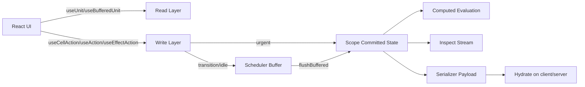
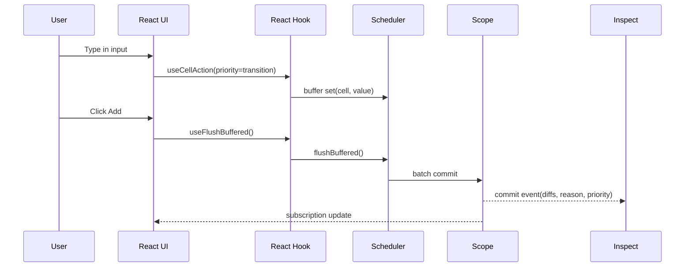

# Architecture

`scope-flux` is intentionally split into small packages so you can adopt only what you need.

This page explains how the pieces fit together and why the architecture is designed this way.

## Package Responsibilities

scope-flux is structured as modular packages:

- **core**: cells/computed/events/effects, scope isolation, commit notifications.
- **react**: `StoreProvider`, `useUnit`, buffered hooks for transition paths.
- **scheduler**: urgent vs buffered update channels (`transition` / `idle`).
- **serializer**: secure payload handling and deterministic hydration.
- **inspect**: trace events, diffs, and DevTools integration.

## Design Principles

- explicit state transitions over implicit mutation
- framework-agnostic runtime in `core`
- strong runtime isolation via `scope`
- optional advanced layers (scheduler/serializer/inspect)
- deterministic behavior suitable for testing and SSR

## Runtime Layers

1. **Committed state path**: authoritative state updates.
2. **Buffered state path**: UI-latency optimization path.
3. **Hydration boundary**: controlled state transfer between runtimes.

## Data Flow Diagram

## Data Flow (Typical React App)

1. UI reads committed or buffered value through hooks.
2. UI writes through `useCellAction` or action hooks.
3. Scheduler decides whether update is urgent (commit now) or buffered (commit later).
4. Scope emits commit records to subscribers.
5. Inspect/devtools can observe commits without changing business logic.

## Scope Isolation Model

`scope` is the core runtime boundary.

- Each scope has independent cell values and subscriptions.
- `store.fork()` creates a new scope from the same store definition.
- No hidden global mutable store is required for app logic.

Typical usage:

- one scope per browser app session
- one scope per server request in SSR
- one scope per test case

## Why Buffered Updates Exist

Some interactions (typing, drag, large list filtering) can produce many updates.

Buffered updates let you:

- keep interaction fluid with transition/idle writes
- explicitly flush when you need authoritative state
- avoid over-committing expensive recomputation during rapid input

## Hydration Boundary

`serializer` handles state transport between runtimes (server -> client).

- only serializable values with stable ids are transported
- payload is validated before hydration
- safe mode avoids accidental repeated overwrites

This keeps SSR/RSC boundaries explicit instead of implicit global rehydration.

## Observability Boundary

`inspect` subscribes to commit stream and produces normalized records.

- can be consumed by logs, telemetry, debug UI, or Redux DevTools adapter
- does not require coupling UI code to debug tooling
- provides reasons and priorities when available

## Practical Architecture Guideline

Use this layering for production:

1. Business state in `core` (`cell`, `computed`, `event`, `effect`)
2. UI bridge in `react` hooks
3. Add `scheduler` only where interaction performance needs it
4. Add `serializer` for SSR/RSC or persistence
5. Add `inspect` for diagnostics and devtools
