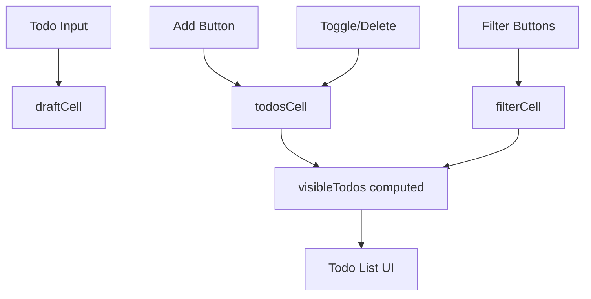
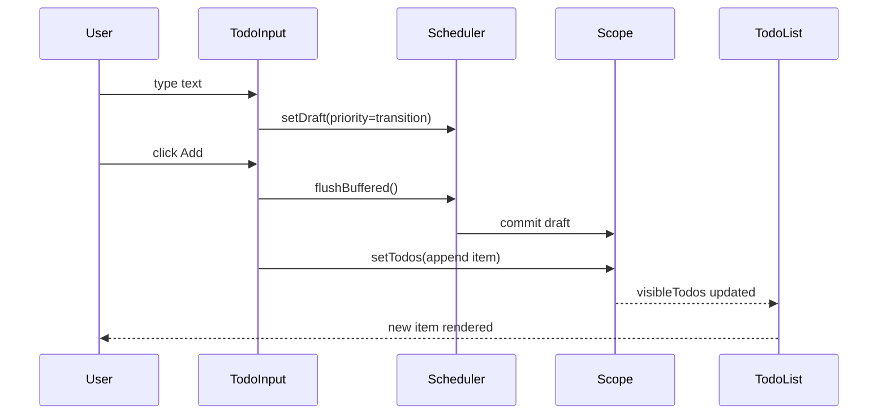

import { TodoTutorialDemo } from './components/TodoTutorialDemo';

# Tutorial: Build a Todo App

This tutorial builds a small but practical Todo app with `scope-flux`.

You will learn:

1. How to model state with `cell` and `computed`
2. How to connect state to React with `StoreProvider`
3. How to read/write state via hooks
4. How to persist and inspect state changes
5. How to run a complete working app

## 0. What We Are Building

The app has:

- a text input for new todos
- add / toggle / delete actions
- filter buttons (`all`, `active`, `done`)
- optional persistence (`serialize` / `hydrate`)

The key point is to separate:

- mutable state (`cell`)
- derived state (`computed`)
- UI actions (`useCellAction`)



## Live Demo (Embedded)

You can use the app below directly inside this page.

- Add / toggle / delete todos
- Switch filter tabs
- Reload the page to confirm persisted state

<TodoTutorialDemo />

## 1. Define State (Core)

First, create `src/state.ts`.

```ts
import { cell, computed } from '@scope-flux/core';

export type Todo = {
  id: string;
  text: string;
  done: boolean;
};

export const todosCell = cell<Todo[]>([], { id: 'todo_todos' });
export const draftCell = cell('', { id: 'todo_draft' });
export const filterCell = cell<'all' | 'active' | 'done'>('all', { id: 'todo_filter' });

export const visibleTodos = computed([todosCell, filterCell], (todos, filter) => {
  if (filter === 'active') return todos.filter((t) => !t.done);
  if (filter === 'done') return todos.filter((t) => t.done);
  return todos;
});
```

Why this shape:

- `todosCell`: source of truth for all Todo items.
- `draftCell`: temporary input value.
- `filterCell`: current list filter.
- `visibleTodos`: derived list. UI reads this instead of re-implementing filter logic.

Why explicit `id` values:

- needed for stable serialization/hydration
- easier debugging in inspect/devtools
- safer if you enforce duplicate-id checks in CI

## 2. Create Scope and Provider

Next, create the store scope and inject it into React tree.

```tsx
import { createStore } from '@scope-flux/core';
import { StoreProvider } from '@scope-flux/react';

const scope = createStore().fork();

export function AppRoot({ children }: { children: React.ReactNode }) {
  return <StoreProvider scope={scope}>{children}</StoreProvider>;
}
```

What happens here:

- `createStore().fork()` creates an isolated runtime scope for this app instance.
- `StoreProvider` makes that scope available to all `@scope-flux/react` hooks below it.

Tip:

- `StoreProvider` should usually live near your app root so all pages/components can share the same scope.

## 3. Build UI with Hooks

Now implement the Todo UI. The snippet below contains three components:

- `TodoInput`: create todos
- `TodoList`: toggle/delete
- `FilterBar`: switch filter

```tsx
import {
  useBufferedUnit,
  useCellAction,
  useFlushBuffered,
  useUnit,
} from '@scope-flux/react';
import { draftCell, filterCell, todosCell, visibleTodos } from './state';

function TodoInput() {
  const draft = useBufferedUnit(draftCell);
  const setDraft = useCellAction(draftCell, { priority: 'transition' });
  const flush = useFlushBuffered();

  const todos = useUnit(todosCell);
  const setTodos = useCellAction(todosCell);

  const onAdd = () => {
    flush();
    const text = draft.trim();
    if (!text) return;
    setTodos([...todos, { id: crypto.randomUUID(), text, done: false }]);
    setDraft('');
  };

  return (
    <div>
      <input
        value={draft}
        onChange={(e) => setDraft(e.target.value)}
        onBlur={() => flush()}
        placeholder="Add todo"
      />
      <button onClick={onAdd}>Add</button>
    </div>
  );
}

function TodoList() {
  const todos = useUnit(visibleTodos);
  const all = useUnit(todosCell);
  const setTodos = useCellAction(todosCell);

  const toggle = (id: string) => {
    setTodos(all.map((t) => (t.id === id ? { ...t, done: !t.done } : t)));
  };

  const remove = (id: string) => {
    setTodos(all.filter((t) => t.id !== id));
  };

  return (
    <ul>
      {todos.map((todo) => (
        <li key={todo.id}>
          <label>
            <input
              type="checkbox"
              checked={todo.done}
              onChange={() => toggle(todo.id)}
            />
            {todo.text}
          </label>
          <button onClick={() => remove(todo.id)}>Delete</button>
        </li>
      ))}
    </ul>
  );
}

function FilterBar() {
  const filter = useUnit(filterCell);
  const setFilter = useCellAction(filterCell);

  return (
    <div>
      {(['all', 'active', 'done'] as const).map((f) => (
        <button key={f} disabled={filter === f} onClick={() => setFilter(f)}>
          {f}
        </button>
      ))}
    </div>
  );
}
```

Important points:

- `useUnit(x)` is for reads.
- `useCellAction(x)` is for writes.
- `useBufferedUnit` + transition priority is good for typing-heavy inputs.
- `flush()` commits buffered input before actions like Add, avoiding stale draft text.
- `TodoList` reads `visibleTodos` for rendering, but updates `todosCell` as the canonical source.



## 4. Optional: Persist State (Serializer)

Use serializer to save/restore app state.

```ts
import { hydrate, serialize } from '@scope-flux/serializer';

const STORAGE_KEY = 'scope-flux-todo-state';

// Save current scope state to localStorage
const payload = serialize(scope);
localStorage.setItem(STORAGE_KEY, JSON.stringify(payload));

// Restore on app startup
const raw = localStorage.getItem(STORAGE_KEY);
if (raw) {
  hydrate(scope, JSON.parse(raw), { mode: 'safe' });
}
```

Notes:

- only cells with explicit stable `id` can be restored reliably
- `mode: 'safe'` avoids reapplying values multiple times unexpectedly

## 5. Optional: Inspect State Changes

You can inspect all commits for debugging.

```ts
import { inspect } from '@scope-flux/inspect';

const stopInspect = inspect({
  scope,
  trace: true,
  onRecord(record) {
    console.log(record.trace.kind, record.trace.unitId, record.diffs);
  },
});

// call stopInspect() when you no longer need tracing
```

What this gives you:

- trace kind (`set`, `event`, `effect`)
- changed unit id
- value diffs per commit

## 6. Complete Working Example

Below is a runnable example using Vite + React.

### 6.1 Install

```bash
npm create vite@latest scope-flux-todo -- --template react-ts
cd scope-flux-todo
npm install
npm install @scope-flux/core @scope-flux/react @scope-flux/serializer @scope-flux/inspect
```

### 6.2 File: `src/state.ts`

```ts
import { cell, computed } from '@scope-flux/core';

export type Todo = {
  id: string;
  text: string;
  done: boolean;
};

export const todosCell = cell<Todo[]>([], { id: 'todo_todos' });
export const draftCell = cell('', { id: 'todo_draft' });
export const filterCell = cell<'all' | 'active' | 'done'>('all', { id: 'todo_filter' });

export const visibleTodos = computed([todosCell, filterCell], (todos, filter) => {
  if (filter === 'active') return todos.filter((t) => !t.done);
  if (filter === 'done') return todos.filter((t) => t.done);
  return todos;
});
```

### 6.3 File: `src/store.ts`

```ts
import { createStore } from '@scope-flux/core';
import { hydrate, serialize } from '@scope-flux/serializer';
import { inspect } from '@scope-flux/inspect';

export const STORAGE_KEY = 'scope-flux-todo-state';
export const scope = createStore().fork();

const raw = localStorage.getItem(STORAGE_KEY);
if (raw) {
  hydrate(scope, JSON.parse(raw), { mode: 'safe' });
}

scope.subscribe(() => {
  const payload = serialize(scope);
  localStorage.setItem(STORAGE_KEY, JSON.stringify(payload));
});

inspect({
  scope,
  trace: true,
  onRecord(record) {
    console.debug('[scope-flux]', record.trace.kind, record.trace.unitId, record.diffs);
  },
});
```

### 6.4 File: `src/App.tsx`

```tsx
import { useMemo } from 'react';
import { StoreProvider, useBufferedUnit, useCellAction, useFlushBuffered, useUnit } from '@scope-flux/react';
import { draftCell, filterCell, todosCell, visibleTodos } from './state';
import { scope } from './store';

function TodoInput() {
  const draft = useBufferedUnit(draftCell);
  const setDraft = useCellAction(draftCell, { priority: 'transition' });
  const flush = useFlushBuffered();

  const todos = useUnit(todosCell);
  const setTodos = useCellAction(todosCell);

  const disabled = useMemo(() => draft.trim().length === 0, [draft]);

  const onAdd = () => {
    flush();
    const text = draft.trim();
    if (!text) return;
    setTodos((prev) => [...prev, { id: crypto.randomUUID(), text, done: false }]);
    setDraft('');
  };

  return (
    <div style={{ display: 'flex', gap: 8, marginBottom: 12 }}>
      <input
        style={{ flex: 1 }}
        value={draft}
        onChange={(e) => setDraft(e.target.value)}
        onBlur={() => flush()}
        placeholder="What needs to be done?"
      />
      <button disabled={disabled} onClick={onAdd}>
        Add
      </button>
    </div>
  );
}

function FilterBar() {
  const filter = useUnit(filterCell);
  const setFilter = useCellAction(filterCell);
  const options = ['all', 'active', 'done'] as const;

  return (
    <div style={{ display: 'flex', gap: 8, marginBottom: 12 }}>
      {options.map((value) => (
        <button key={value} disabled={filter === value} onClick={() => setFilter(value)}>
          {value}
        </button>
      ))}
    </div>
  );
}

function TodoList() {
  const list = useUnit(visibleTodos);
  const setTodos = useCellAction(todosCell);

  const toggle = (id: string) => {
    setTodos((prev) => prev.map((t) => (t.id === id ? { ...t, done: !t.done } : t)));
  };

  const remove = (id: string) => {
    setTodos((prev) => prev.filter((t) => t.id !== id));
  };

  if (list.length === 0) {
    return <p>No todos yet.</p>;
  }

  return (
    <ul style={{ paddingLeft: 16 }}>
      {list.map((todo) => (
        <li key={todo.id} style={{ marginBottom: 8 }}>
          <label style={{ marginRight: 8 }}>
            <input type="checkbox" checked={todo.done} onChange={() => toggle(todo.id)} />
            {' '}
            {todo.text}
          </label>
          <button onClick={() => remove(todo.id)}>Delete</button>
        </li>
      ))}
    </ul>
  );
}

export default function App() {
  return (
    <StoreProvider scope={scope}>
      <main style={{ maxWidth: 560, margin: '24px auto', fontFamily: 'sans-serif' }}>
        <h1>scope-flux Todo</h1>
        <TodoInput />
        <FilterBar />
        <TodoList />
      </main>
    </StoreProvider>
  );
}
```

### 6.5 File: `src/main.tsx`

```tsx
import React from 'react';
import ReactDOM from 'react-dom/client';
import App from './App';

ReactDOM.createRoot(document.getElementById('root')!).render(
  <React.StrictMode>
    <App />
  </React.StrictMode>
);
```

### 6.6 Run

```bash
npm run dev
```

Open the URL shown by Vite, then:

1. Add a few todos
2. Toggle and filter them
3. Reload the page and confirm state persistence via localStorage
4. Check browser console for inspect traces

## Recap

- Use `cell` for mutable state and `computed` for derived state.
- Use `useCellAction` for updates and `useUnit` / `useBufferedUnit` for reads.
- Use explicit `id` values when you need stable serialization and traceability.
- Keep UI logic thin by pushing derivation rules into `computed`.
